# Security Risk Assessment and Threat Modeling of Web Applications

**Repository:** [thetruesammyjay/SRATMWA](https://github.com/thetruesammyjay/SRATMWA)

---

## Overview

This project provides a structured methodology for conducting security risk assessments and threat modeling on web applications. It covers the identification, analysis, and prioritization of threats and vulnerabilities across the web application stack — from the client layer through to the backend, data storage, and third-party integrations.

The goal is to produce actionable security intelligence that engineering and security teams can use to reduce attack surface, prioritize remediation, and maintain a defensible architecture.

---

## Scope

The assessment and threat modeling methodology in this project applies to:

- Web application frontends (browser-based clients)
- Backend APIs and server-side logic
- Authentication and session management systems
- Database and data storage layers
- Third-party integrations and dependencies
- Infrastructure and deployment configurations

---

## Methodology

This project combines two complementary approaches:

### 1. Threat Modeling

Threats are identified and categorized using the **STRIDE** framework, analyzed for likelihood and impact using **DREAD**, and mapped through an end-to-end attack simulation using the **PASTA** (Process for Attack Simulation and Threat Analysis) methodology.

### 2. Risk Assessment

Identified threats are assessed using a structured risk assessment process aligned with **NIST SP 800-30** and **OWASP Risk Rating Methodology**.

---

## STRIDE Threat Categories

| Category | Description | Example |
|---|---|---|
| **Spoofing** | Impersonating a user or component | Credential theft, forged tokens |
| **Tampering** | Modifying data or code | SQL injection, parameter manipulation |
| **Repudiation** | Denying actions occurred | Missing audit logs, log tampering |
| **Information Disclosure** | Exposing sensitive data | Data leaks, verbose error messages |
| **Denial of Service** | Degrading or disrupting availability | Rate-limit bypass, resource exhaustion |
| **Elevation of Privilege** | Gaining unauthorized permissions | Broken access control, IDOR |

---

## Web Application Attack Surface

```mermaid
graph LR
    subgraph Client Layer
        A1[Browser]
        A2[Mobile Client]
    end

    subgraph Perimeter
        B1[CDN / WAF]
        B2[Load Balancer]
    end

    subgraph Application Layer
        C1[Web Server]
        C2[REST API]
        C3[GraphQL API]
    end

    subgraph Auth Layer
        D1[OAuth 2.0 / OIDC]
        D2[Session Manager]
        D3[MFA Provider]
    end

    subgraph Backend Layer
        E1[Business Logic]
        E2[Background Jobs]
        E3[File Storage]
    end

    subgraph Data Layer
        F1[Relational DB]
        F2[Cache - Redis]
        F3[Object Storage]
    end

    subgraph External
        G1[Third-party APIs]
        G2[Payment Gateway]
        G3[Email / SMS Service]
    end

    A1 --> B1
    A2 --> B1
    B1 --> B2
    B2 --> C1
    C1 --> C2
    C1 --> C3
    C2 --> D1
    C2 --> D2
    D1 --> D3
    C2 --> E1
    C3 --> E1
    E1 --> F1
    E1 --> F2
    E2 --> F1
    E1 --> F3
    E1 --> G1
    E1 --> G2
    E1 --> G3
```

---

## Risk Scoring Matrix

Risk is calculated as:

$$\text{Risk Score} = \text{Likelihood} \times \text{Impact}$$

| Score Range | Risk Level | Response |
|---|---|---|
| 9 — 10 | Critical | Immediate action required |
| 7 — 8 | High | Remediate within sprint |
| 4 — 6 | Medium | Planned remediation |
| 1 — 3 | Low | Accept or monitor |

---

## OWASP Top 10 Coverage

This project addresses threats mapped to the OWASP Top 10 (2021):

| # | Category |
|---|---|
| A01 | Broken Access Control |
| A02 | Cryptographic Failures |
| A03 | Injection |
| A04 | Insecure Design |
| A05 | Security Misconfiguration |
| A06 | Vulnerable and Outdated Components |
| A07 | Identification and Authentication Failures |
| A08 | Software and Data Integrity Failures |
| A09 | Security Logging and Monitoring Failures |
| A10 | Server-Side Request Forgery (SSRF) |

---

## Project Workflow

---

## Project Structure

See [File-Structure.md](File-Structure.md) for the full breakdown of the project layout.

---

## References and Standards

| Standard / Framework | Application |
|---|---|
| NIST SP 800-30 | Risk assessment process |
| NIST SP 800-53 | Security control catalogue |
| OWASP WSTG | Web security testing guidance |
| OWASP ASVS | Application security verification |
| MITRE ATT&CK for Enterprise | Adversary tactics and techniques |
| CVSS v3.1 | Vulnerability severity scoring |
| ISO/IEC 27005 | Information security risk management |

---

## Contributing

Contributions are welcome. Please open an issue to discuss proposed changes before submitting a pull request. All additions should follow the existing documentation structure and reference established security frameworks where applicable.

---

## License

This project is licensed under the MIT License. See the `LICENSE` file for details.
